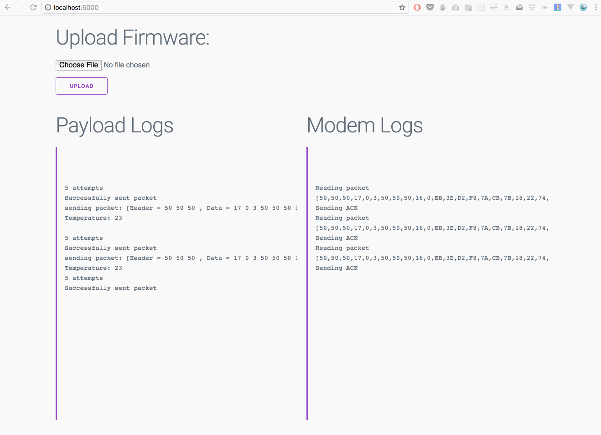

# Dev Tools

This is currently a web service that allows you to remotely flash arduinos with your firmware and then observe the serial output.

## Dependencies

- Node.js

## Installing

```sh
npm install
```

## Running

```sh
node server.js /path/to/payload/usb /path/to/modem/usb
```





### Todo

- implement flashing firmware uploads
